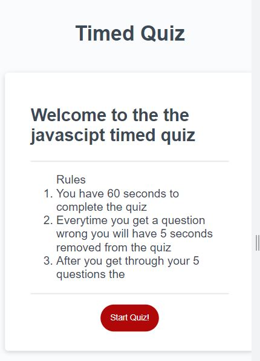

# Timed Quiz
 
## Project Description
Create a timed quiz that will store high scores

## Acceptance Criteria
GIVEN I am taking a code quiz
1. WHEN I click the start button
THEN a timer starts and I am presented with a question
2. WHEN I answer a question
THEN I am presented with another question
3. WHEN I answer a question incorrectly
THEN time is subtracted from the clock
4. WHEN all questions are answered or the timer reaches 0
THEN the game is over
5. WHEN the game is over
THEN I can save my initials and score 

## Screenshots and Links
Link: [Take the timed quiz now](https://colinc27.github.io/TimedQuizChallenge4/)

## Made by Colin Christoph